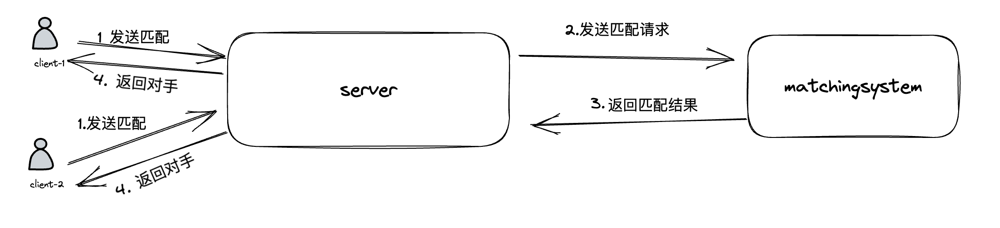
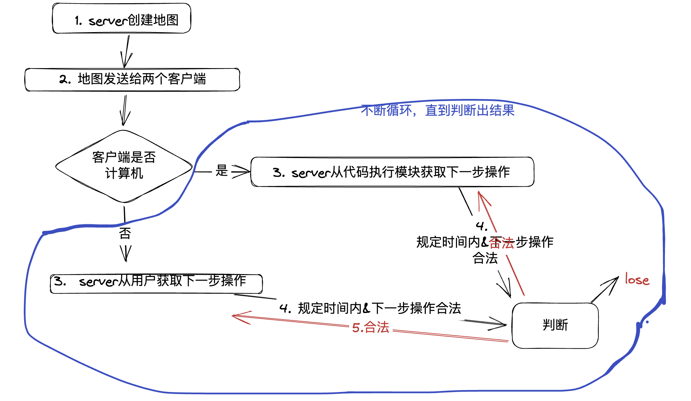
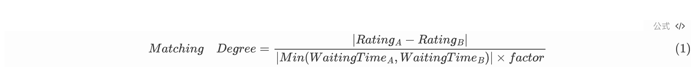

# Name
[Badges] 33 

# Introduction

# Summary

# Features 
该项目的模块结构流程图如下所示：

对于整个系统的匹配逻辑，考虑到匹配过程中的耗费的时间或资源问题，将匹配操作单独作为一个服务,使用`Rest`方式实现服务间通信。

匹配成功之后，对`client`游戏过的程序执行流程图如下所示：

整体的流程是：

​		用户开始匹配的时候，会向**后端**发送请求，会在后端开启一个新的`websocket`连接。接收到开始匹配的请求之后，将匹配的请求发送给**匹配系统**，匹配系统按照某种算法<u>衡量用户的相似度</u>。**匹配系统**将相似度最高的两名客户端分别返回给客户端，告知匹配对象，并将匹配到的对手的信息分别返回两个客户端。

​		并在此时，匹配成功之后，后端开始创建地图，并将地图信息发送给匹配好的两个客户端，以实现两名玩家对战的时候地图是一只的。之后，不断的在规定的时间内获取用户的下一步操作，每次获得下一步操作都需要判断操作的合法性。最后得出对战的结果。

匹配系统的逻辑： 接收到一个请求之后，会将当前匹配的用户都放到一个池子里面。开一个额外的新线程，每个一秒中扫描一边整个数组，将能够匹配的人匹配到一起。

有关于`playerA`和`playerB`的匹配相似度

当前系统，我们另`factor = 10`, 当`Matching degree` 小于`1`的时候，说明是可以进行匹配的，否则`playerA`和`playerB`不进行匹配。

# Requirements

- JDK 1.8
- SpringCloud 

# Configuration 

# Installation 
# Usage
fdsa

# Development
# Changelog 
# FAQ 
# Support 
# Dos 
# Contact 

# Authors and acknowledgment
Cao Jupeng

# License
Scut Srp
